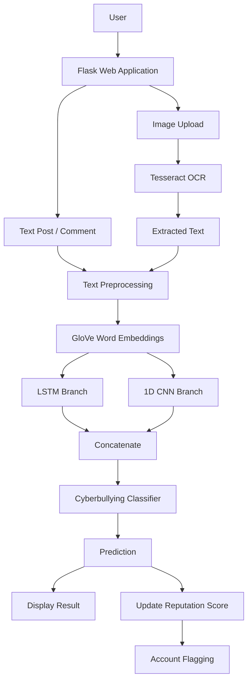

# Twinstagram — Cyberbullying Detection Using LSTM + CNN

> A Flask-based social-media application that detects cyberbullying in user-generated text and OCR-extracted image text, helping identify harmful content and track user reputation.


**Live demo:** Not deployed yet

**Stack:**


---

## What this demonstrates

- **End-to-end ML application** — Integrated a trained TensorFlow/Keras hybrid LSTM + 1D CNN text classifier into a Flask web application for cyberbullying detection.
- **Hybrid text classification** — Used LSTM to capture sequential word relationships and 1D CNN to identify local patterns in the same GloVe-based text representation.
- **Real-world input handling** — Processes both normal text posts and text extracted from uploaded images using Tesseract OCR before sending the content through the detection pipeline.

## Architecture



## Quick start

**1. Clone the repository**
```bash
git clone https://github.com/sudinvp/cyberbullying-detection.git
cd cyberbullying-detection
```

**2. Create a virtual environment**

Windows:
```bash
python -m venv venv
venv\Scripts\activate
```

macOS/Linux:
```bash
python -m venv venv
source venv/bin/activate
```

**3. Install dependencies**
```bash
pip install -r requirements.txt
```

**4. Configure environment variables**

Copy `.env.example` to `.env`.

Windows:
```bash
copy .env.example .env
```

macOS/Linux:
```bash
cp .env.example .env
```

Configure the optional values in `.env` if required.

**5. Run the application**
```bash
python app.py
```

Open http://127.0.0.1:5000

## Architecture decisions (the "why")

**Why Flask?**
Flask provides a lightweight way to integrate the machine-learning model with the web application. It keeps the project simple while allowing the trained TensorFlow/Keras model to be used for inference.

**Why combine LSTM and 1D CNN?**
The project combines two approaches for text classification: LSTM captures sequential relationships between words, while 1D CNN captures local patterns in text. Both branches operate on the same GloVe-based text representation, and their outputs are combined before the final classification layer.

**Why use OCR for uploaded images?**
The current application does not perform direct image-content classification. Tesseract OCR extracts text from an uploaded image, and that extracted text is passed through the existing LSTM + CNN text-classification pipeline.

## What I struggled with

- Integrating the TensorFlow/Keras model with Flask while keeping model loading and inference consistent.
- Organizing the Flask application into separate modules and blueprints.
- Handling image uploads and OCR failures without causing the application to crash.
- Managing environment-dependent configuration such as Tesseract and Telegram integration.
- Preventing duplicate usernames during registration and handling invalid user input safely.

## Roadmap

- [x] v0.1 — Flask application with core cyberbullying detection
- [x] v0.2 — Hybrid LSTM + 1D CNN model integration
- [x] v0.3 — Image text extraction using OCR
- [x] v0.4 — User profiles and reputation tracking
- [ ] v0.5 — Automated application tests
- [ ] v0.6 — Public deployment
- [ ] v1.0 — Direct image-content classification using a dedicated image model

## Code style

This repository follows standard Python coding conventions with readable naming, consistent indentation, and modular project organization. For Python style guidance, see the [Google Python Style Guide](https://google.github.io/styleguide/pyguide.html).

## Contributing

PRs are welcome.

Before submitting a pull request:
1. Fork the repository.
2. Create a new branch for your changes.
3. Make and test your changes.
4. Commit your changes with a clear message.
5. Submit a pull request describing the changes.

## License

MIT — see [LICENSE](LICENSE).
